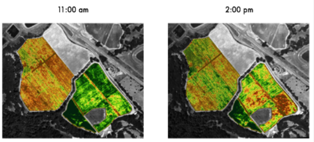

___________________________________________________
___________________________________________________
# Satellite Data Analysis:

This document outlines the neccessary requirements and considerations for using Google Earth Engine api on Python. It is important
to note that the following code and functions has been directly converted from Java, which is relatively well documented (In Java).

This document provides python script to load and read satellite data for the coordinates of the farm. 
The farm coordinates are provided in a GeoJSON format, which are presented in /region_coordinates/polygon_true.json. 
The coordinates must be in a rectangle of interest. It is important to limit the number of pixels or size of the rectangle as there are computational limits. 

The scripts are excuted on Google's server, which is why computational limits exist. However, for Sentinel 2 data (10 meter resolution) the approximate limit 
is 2000 pixels by 2000 pixels or a (20 km by 20 km domain). 
Large domain sizes can be selected on LandSat 7 and 8, which have 30 meter pixel resolution.

### Installtion of Google Earth Engine:
The following steps are required to install google earth engine. 

	- Load your conda environment
	- conda install -c conda-forge earthengine-api:
	- import ee
	- ee.Authenticate()
	- ee.Initalise()

Alternatively, you can type in "earthengine authenticate" on terminal if you are executing code on the terminal 
(not neccessary if this is already in your python script). For more information about the installation of google earth engine, please refer to the 
following links :
-[links]( https://developers.google.com/earth-engine/python_install-conda)
-[links](https://developers.google.com/earth-engine/python_install)

### Packages
The packages need for this analysis are:

	- 1. ee (Google Earth Engine).
	
	- 2. json.
	
	- 3. numpy.
	
	- 4. scipy (scipy.stats).
	
	- 5. matplotlib (matplotlib.pyplot).

# Satellite Collections
 There are a variety of satellite collections that can be easily accessed in Google Earth Engine and are updated in near-real-time. These include
 climate data/weather forecasts, Sentinel 1,2,3,5 (ESA), MODIS (coarse resolution) and LandSat 1-8 data (USGS). More information about the satellite products,
 including the band names (i.e visible and near infrared band codes/wavelengths and keynames) can be found in the following [link](https://developers.google.com/earth-engine/datasets/catalog/LANDSAT_LE07_C01_T1_SR).
 

The class SatelliteCollection extracts the following attributes:

	- 1. LandSat 8 Surface Reflectance (Atmospherically Corrected) - R, G, B bands and computed NDVI (if cloud cover is low). 
	Coverage: 2013-Present, Repeat time: 16 Days, Resolution: 30m.
	- 2. LandSat 8, 8 Day EVI(Atmospherically Corrected). 
	Coverage: 2013-Present, Repeat time: 8 Days, Note: Retrieval Frequency is 16 days and some data may not be available: .
	- 3. LandSat 8, 8 Day NDVI(Atmospherically Corrected). 
	Coverage: 2013-Present, Repeat time: 8 Days, Note: Retrieval Frequency is 16 days and some data may not be available: .
	- 4. LandSat 8, 8 Day NDWI(Atmospherically Corrected Moisture Content). 
	Coverage: 2013-Present, Repeat time: 8 Days, Note: Retrieval Frequency is 16 days and some data may not be available: .
	- 6. LandSat 7, Surface Reflectance (Atmospherically Corrected) - R, G, B bands and computed NDVI (if cloud cover is low). 
	Coverage: 1999-Present, Repeat time: 16 Days, 30 m resolution.
	- 7. Sentinel 2, Surface Reflectance (Atmospherically Corrected) - R, G, B bands and computed NDVI (if cloud cover is low). 
	Coverage: 2015-Present, Repeat time: 5 Days, Resolution: 10m.

It is important to note, that there are collections that have not been extensively explored, these include Sentinel 1 SAR data. 
This data will be commented in the code. Other unfinished mappings such as the LAI and EVI, will be documented. 

For more information about the satellites and the physical motivations, please see the attached pdfs, Remote_Sensing_Theory_and_Experiments
 and Remote_Sensing_Services.
 
 
 
 
## II. Project Structure:
The project consists of two key modules, which consist of a wide variety of functions. The modules are stored in the folder
** /lib **. Within the directory ** /lib ** the folders are organised in the following manner:
- /lib:
    - satellite_analyse
        - 1. collection_mappings.py : computes ndvi from Landsat and sentinel 2 satellite bands, a mapping google earth engine
            object.
        - 2. FilterCollection.py: inherited by GetSatData, but it filters out the satellite data based on time, regional and cloud
            cover constraints.
        - 3. GetBandsMeta: Also inherited by GetSatData, but provide information about the resolution and wavelength of the bands.
        - 4. grid_and_attribute.py: the **grid_array** function organises the data to an image format, and **get_arr_attr** gets the attributes
            from an individual array.
        - 5. LoadRegionMetaData.py: Loads a ee.Geometry.Rectangle object from rectangle coordinates that are specified in a .json file. 
            These are used/ inherited in **FilterCollection**.
        - 6. GetSatData: this inherits attributes from all previous classes, and outs either an average or time-series of the images of all the images 
            in the time range searched. NDVI is also output. However, currently, the time-series is not accessible (bug).

- examples.py
    2. Contains example script files that show examples of the usages of these classes. 
- /satellite_data/
    :
    - **/region_coordinates**: a .json file with the coordinates of the farm/region of interest, this needs to be configured.
    - /satellite_metadata: a .json file with information about the metadata of each of the satellites. 
    - **README.md**: this readme.md file contains important information about how the satellite data is analysed, and how to important
        the various modules.
    - **.pdfs**:  Further information about satellite data and products.     
    

    
## I.  Notes:
At visible wavelengths there is negligible absorption of solar radiances by atmospheric gases. 
However, the gasses reduce the intensity of solar radiation through scattering (two-way transmittance). 
Scattering is also wavelength-dependent (Rayleigh scattering), more complex corrections are required (through radiative transfer).

One of the most important limitations of NDVI is its dependency on the time of day at which the aerial images are taken or in more technical terms,
its solar incident angle. 
Since NDVI does not correct for changes in solar incidence angle (the angle at which the sun shines on the leaves) 
NDVI produces vastly different results throughout the day.

NDVI produces inaccurate data due to varying factors including shadowing, air moisture, and variations in the soil.
For example, throughout a couple of hours, changes in pasture cover (assuming no grazing) would be negligible. 
However, because NDVI is sensitive to solar incidence angle, there are large variations (independent of pasture), 
as illustrated in the Figure below.

For more information of the diurnal variability of NDVI please see the following - [reference](https://www.vineview.com/evi-vs-ndvi-whats-difference/)

    
 #### Research Overview
It is important to note, that the largest dependance on NDVI is solar incidence angle (or time of day). 
If you are using a sun-synchronous satellite (samples at the same local time everywhere), this effect will be consistent amongst all images.
If you are combining multiple satellites, this becomes an issue (i.e LandSat and Sentinel). The other first-order effect is cloud cover, 
as even thin (not visible to the human eye), can offset NDVI measurements. Therefore, an effective cloud mask is necessary when using satellite data. 
Other factors such as air moisture and soil moisture are generally second-order. Hence we use